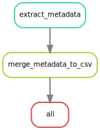

# Crab Video Processing Pipeline

## Current DAG




## Run the Snakemake pipeline

*Note*: may take a while the first time.

```
bash run_pipeline_hpc.sh
```


## Run Jupyter Lab

*Note*: may take a while the first time.

```
bash run_jupyter.sh
```


# FAQs

### I'm running this on my laptop, and the data is on a USB drive.  Can I still run the same pipeline?

Yes!  All that's needed is to mount the data folder to the /data/raw directory in the snakemake singularity image.

  1. *Note:* If using WSL, [mount the drive on the filesystem](https://www.howtogeek.com/331053/how-to-mount-removable-drives-and-network-locations-in-the-windows-subsystem-for-linux/) first so you can access it:

  2. Run snakemake with your bind path and the settings you want (e.g. `singularity run --bind /my/path:/data/raw snakemake.sif --cores 1 --use-conda`)


###  How do I start an Interactive Session on the SWC Cluster?

  1. SSH to the Login Node to get into SWC's :  `ssh username@ssh.swc.ucl.ac.uk`
  2. Once logged in, SSH from there to the HPC Login Node to get into the HPC Network: `ssh username@hpc-gw1`
  3. Once in, start an interactive bash session using the **srun** command: `srun --pty bash -i`
  4. You're in!  Start coding! 

### I don't like typing my password all the time.  Is there a way to send a keypair instead?

Yep!  Do the following twice: once for connecting to the ssh from your computer, then again
from the ssh node to connect to the hpc-gw1 node:

```
ssh-keygen -t ed25519
ssh-copy-id username@ssh.swc.ucl.ac.uk
```


You can learn more here: https://www.digitalocean.com/community/tutorials/how-to-set-up-ssh-keys-2

### Can I jump directly to the hpc-gw1 node without typing two sets of ssh commands?

Yes, you can jump hosts with the '-J' flag:

```
ssh -J username@ssh.swc.ucl.ac.uk username@hpc-gw1
```

### How do I mount a usb drive in linux?

```sudo mount -t drvfs f: /mnt/f```


### How access Jupyter lab on my computer if it's running on the server?

After running jupyter lab, note the port number and ip address.  
Then make a new SSH connection, forwarding the port from that node to your
local machine:

```
 ssh -L 8888:node-ip-name:8888 username@ssh.swc.ucl.ac.uk
``` 

### Jupyter Lab's R Kernel makes plots that are too big.  How do I change them?

```r
options(repr.plot.width=5, repr.plot.height=4)
```