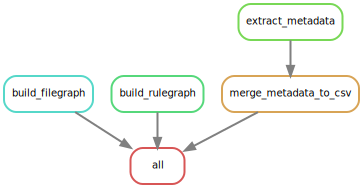

# Crab Field Data Pripeline



## Install Snakemake

```
module load miniconda
conda env create -n snakemake tools/snakemake/environment.yml
```

## Run the Snakemake pipeline


Activate the snakemake environment:
```
module load miniconda
conda activate snakemake
cd pipelines/crab_field
```


Running on the HPC:
```
snakemake --use-conda --cores 3
```

Running on another environment, like your local computer. You might need to override the paths to your data.  See the `config.yaml` file for the default locations.
```
snakemake --use-conda --cores 1  --config raw_path=/my/path/to/videos/,processed_path=/where/results/go
```


